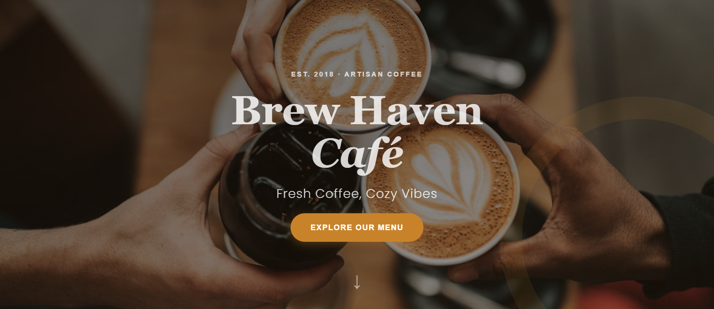
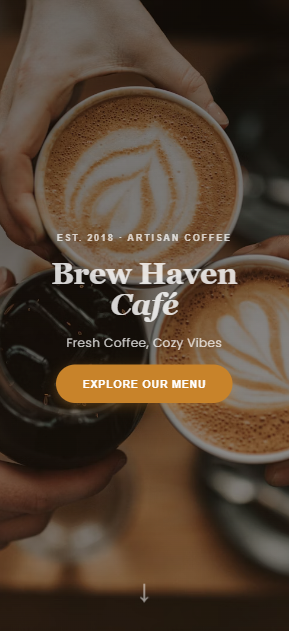
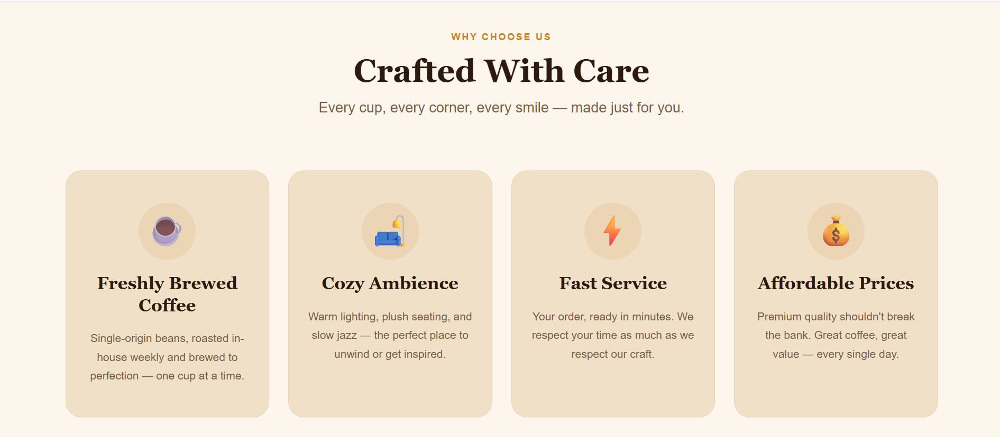
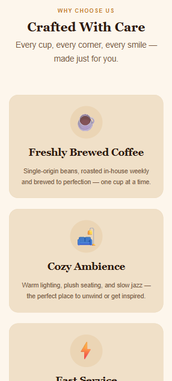
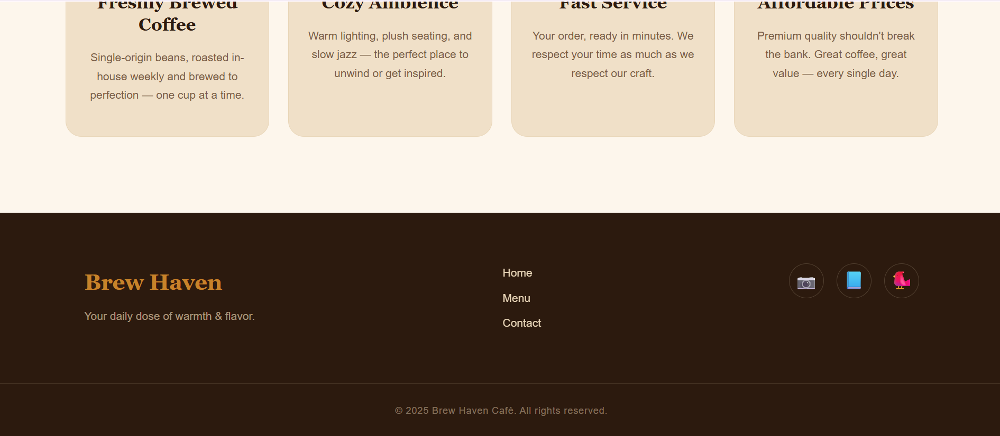
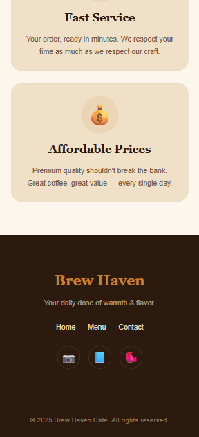

# Brew Haven Café ☕

A clean, modern, and fully responsive café landing page built using only HTML and CSS.

This project follows a modular CSS structure for better maintainability, readability, and easier customization. The website is designed with a warm café-inspired aesthetic and works smoothly across desktop and mobile devices.

---

## 📌 Project Overview

Brew Haven Café is a responsive landing page created for a fictional coffee café brand.

The project focuses on:
- Responsive web design
- Modern UI principles
- Modular CSS architecture
- Beginner-friendly structure
- Clean and maintainable code

No JavaScript or frameworks were used.

---

## 🖼️ Screenshots

### Hero Section
| Desktop | Mobile |
|---------|--------|
|  |  |

### Features Section
| Desktop | Mobile |
|---------|--------|
|  |  |

### Footer
| Desktop | Mobile |
|---------|--------|
|  |  |

---

## ✨ Features

### Hero Section
- Café name and branding
- Warm coffee background
- Catchy tagline
- CTA button ("Order Now")

### Features Section
Includes feature cards such as:
- Freshly Brewed Coffee
- Cozy Ambience
- Fast Service
- Affordable Prices

### Footer
- Navigation links
- Café branding
- Social media placeholders

---

## 🎨 Design Details

**Fonts Used** — Google Fonts:
- Playfair Display
- Lato

**Color Palette** — Warm café-inspired colors:

| Name | Hex |
|------|-----|
| Espresso Brown | `#2C1A0E` |
| Caramel Gold | `#C8832A` |
| Cream | `#FDF6EC` |

---

## 📱 Responsive Design

The website is fully responsive and optimized for:
- Desktop screens
- Tablets
- Mobile devices

Responsive techniques used: CSS Grid, Flexbox, and Media Queries.

---

## 🛠️ Technologies Used

| Technology | Purpose |
|------------|----------|
| HTML5 | Website Structure |
| CSS3 | Styling |
| Flexbox | Layout |
| CSS Grid | Responsive Cards |
| Google Fonts | Typography |

---

## 📂 Project Structure

```txt
SYNENT-TASK2-RESPONSIVELA...
├── .vscode
├── feature-dekstop.png
├── feature-mobileview.png
├── features.css
├── footer-dekstop.png
├── footer-mobileview.png
├── footer.css
├── hero-dekstop.png
├── hero-mobileview.png
├── Hero.css
├── index.html
├── layout.css
├── reset.css
└── variables.css
```

---

## 🚀 How to Run the Project

1. Download or clone the repository
2. Open the project folder
3. Open `index.html` in your browser

No installation or setup required.

---

## 🛠️ CSS File Responsibilities

| File | Purpose |
|------|----------|
| `reset.css` | Removes browser default styling |
| `variables.css` | Stores reusable colors, fonts, spacing |
| `layout.css` | Global layout and reusable utilities |
| `Hero.css` | Hero section styling |
| `features.css` | Feature cards styling |
| `footer.css` | Footer styling |

---

## ✏️ Customization Guide

**Change Café Name** — Open `index.html` and find:
```html
<h1>Brew Haven Café</h1>
```

**Change Colors** — Open `variables.css` and modify:
```css
--primary-color
--secondary-color
--background-color
```

**Change Background Image** — Open `Hero.css` and update:
```css
background: url('YOUR_IMAGE_LINK') center/cover no-repeat;
```

**Add More Feature Cards** — Open `index.html` and duplicate any feature card block inside the features section.

---

## 🔮 Future Improvements

- JavaScript animations
- Online ordering system
- Café menu page
- Contact form
- Dark mode
- Backend integration

---

## 👩‍💻 Author

Developed by: Hiteshree chauhan

---

## 📜 License

This project is created for educational and learning purposes only.
